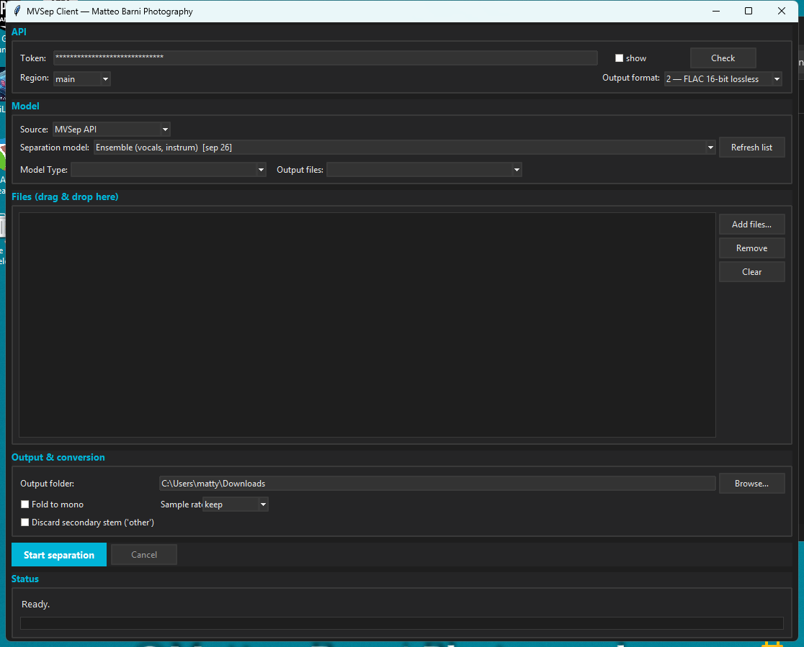

<a id="readme-top"></a>

<!-- PROJECT SHIELDS -->
[![Python][python-shield]](https://www.python.org/downloads/release/python-3119/)
[![Platform][platform-shield]](#)
[![License][license-shield]][license-url]
[![Version][version-shield]](#)

<br />
<div align="center">
  <h1 align="center">MVSep Client</h1>
  <p align="center">
    A polished Windows desktop client for AI stem separation — cloud (MVSep API) and local (audio-separator), in one dark-mode tkinter app.
    <br />
    <a href="#getting-started"><strong>Explore the docs »</strong></a>
    <br />
    <br />
    <a href="#usage">View Usage</a>
    ·
    <a href="https://github.com/mbpitaly/mvsep-client/issues/new?labels=bug&template=bug_report.md">Report Bug</a>
    ·
    <a href="https://github.com/mbpitaly/mvsep-client/issues/new?labels=enhancement&template=feature_request.md">Request Feature</a>
  </p>
</div>

<!-- TABLE OF CONTENTS -->
<details>
  <summary>Table of Contents</summary>
  <ol>
    <li><a href="#about-the-project">About The Project</a></li>
    <li><a href="#features">Features</a></li>
    <li><a href="#getting-started">Getting Started</a>
      <ul>
        <li><a href="#prerequisites">Prerequisites</a></li>
        <li><a href="#installation">Installation</a></li>
      </ul>
    </li>
    <li><a href="#usage">Usage</a></li>
    <li><a href="#configuration">Configuration</a></li>
    <li><a href="#engines">Engines</a>
      <ul>
        <li><a href="#mvsep-api">MVSep API</a></li>
        <li><a href="#local-audio-separator">Local (audio-separator)</a></li>
      </ul>
    </li>
    <li><a href="#stem-naming">Stem Naming</a></li>
    <li><a href="#building-from-source">Building From Source</a></li>
    <li><a href="#project-layout">Project Layout</a></li>
    <li><a href="#contributing">Contributing</a></li>
    <li><a href="#license">License</a></li>
    <li><a href="#acknowledgments">Acknowledgments</a></li>
  </ol>
</details>

<!-- ABOUT THE PROJECT -->
## About The Project



MVSep Client is a single-file tkinter GUI that wraps two stem-separation engines behind one interface:

- **MVSep API** — a remote queue with 117+ separation models, multiple mirrors and 6 output formats.
- **Local (audio-separator)** — on-device CUDA separation using local `.ckpt` / `.onnx` models.

It was built by Matteo Barni (2026) to make stem-extraction fast and fully autonomous: drag files in, pick a model, start, done.

<p align="right">(<a href="#readme-top">back to top</a>)</p>

<!-- FEATURES -->
## Features

- **Two engines, one UI** — switch sources without touching a config file
- **Drag & drop** file queue (or "Add files…")
- **Intelligent stem renaming** — `somebody-to-love_piano-model_mt_5_piano.flac` → `piano.flac`, `song_model_lead_vocals.flac` → `lead vocals.flac`; collisions auto-increment (`piano_1.flac`) instead of overwriting
- **Discard secondary stem** toggle — drops `other` / `others` automatically
- **ffmpeg post-processing** — fold-to-mono + resample (soxr precision 28, Lipshitz dither)
- **Dark theme** — `#1e1e1e` background, teal `#00b4d8` accent (sampled from the app icon)
- **Dead-center window** spawn, status label + big progress bar, no log spam
- **First-run token auto-import** from the `mvsep-cli` config (`~/.mvsep_cli_config`)
- **Settings persistence** — token, mirror, model, output folder all survive restarts

### Built With

- [Python 3.11](https://www.python.org/) + [tkinter/ttk](https://docs.python.org/3/library/tkinter.html)
- [tkinterdnd2](https://pypi.org/project/tkinterdnd2/) — native drag & drop
- [audio-separator](https://pypi.org/project/audio-separator/) — local engine
- [ffmpeg](https://ffmpeg.org/) — post-processing
- [PyInstaller](https://pyinstaller.org/) — standalone exe packaging

<p align="right">(<a href="#readme-top">back to top</a>)</p>

<!-- GETTING STARTED -->
## Getting Started

### Prerequisites

- **Windows 10/11** (tkinter comes with the official Python installer; the packaged exe needs nothing)
- **ffmpeg** — bundled with the installer; source builds need it on `PATH` (the app also falls back to `C:\Program Files\FFmpeg\bin\ffmpeg.exe`)
- A **MVSep API token** for cloud separation ([mvsep.com](https://mvsep.com)) — or local models for the on-device engine
- Optional: a CUDA-capable GPU + `audio-separator` for the local engine

### Installation

**Option A — installer (Windows)**

Download `MVSep_Client_Setup.exe` from the [Releases](https://github.com/mbpitaly/mvsep-client/releases) page and run it. The installer bundles **ffmpeg**, so post-processing (fold-to-mono, resampling) works out of the box — no separate ffmpeg install needed.

**Option B — from source**

```sh
# 1. Clone
git clone https://github.com/mbpitaly/mvsep-client.git
cd mvsep-client

# 2. Install the only runtime dependency
python -m pip install tkinterdnd2

# 3. Run
python mvsep_client.pyw
```

<p align="right">(<a href="#readme-top">back to top</a>)</p>

<!-- USAGE -->
## Usage

1. Launch `MVSep Client.exe` — the window opens centered, dark mode already on.
2. Paste your **MVSep API token** in the *API* box (or let it auto-import on first run). Hit **Check** to verify.
3. Pick a **model** (or switch Source to *Local (audio-separator)* and choose a local model).
4. Drop your audio files into the list.
5. Set the **output folder** and options (fold to mono, sample rate, discard secondary).
6. Hit **Start separation**.

Progress shows in the status bar; every delivered file is renamed to its clean stem name. Cancel stops the queue after the current step.

### Troubleshooting

| Symptom | Fix |
|---|---|
| "ffmpeg failed" on conversion | The installer build already bundles ffmpeg. If running from source: install ffmpeg and add it to `PATH`, or put `ffmpeg.exe` in `C:\Program Files\FFmpeg\bin\` |
| API check fails | Wrong token, or the chosen mirror is down — try another region (de / de2 / hk) |
| "(no models in …)" | Local models dir is `C:\Program Files\UVR5-UI\models` — drop `.ckpt` / `.onnx` files there and hit Rescan |
| audio-separator not found | Install the shim: `uv tool install audio-separator` |
| Job stuck on "processing" | Non-premium accounts run 1 job at a time — wait for the queue, or check the MVSep web dashboard |

<p align="right">(<a href="#readme-top">back to top</a>)</p>

<!-- CONFIGURATION -->
## Configuration

Settings live in `%APPDATA%\MVSepClient\config.json` and are written on every run:

| Key | Meaning |
|-----|---------|
| `token` | MVSep API token (auto-imported from `~/.mvsep_cli_config` on first run) |
| `mirror` | API mirror: `main`, `de`, `de2`, `hk` |
| `output_format` | 0=MP3 320k, 1=WAV 16-bit, 2=FLAC 16-bit, 3=M4A, 4=WAV 32-bit float, 5=FLAC 24-bit |
| `output_dir` | Where finished stems land (default: your Downloads folder) |
| `fold_mono` | Fold output to mono |
| `sample_rate` | `keep` or 44100 / 48000 / 88200 / 96000 / 176400 / 192000 |
| `discard_secondary` | Drop `other`/`others` stems when multiple files come back |
| `source` | `MVSep API` or `Local (audio-separator)` |
| `last_model` | Last used MVSep API model (`render_id`) |
| `local_model` / `local_stem` / `local_format` | Local engine selection |

> 🔒 **Security**: the token is stored **only** in your local config file. It is never logged, never sent anywhere except MVSep, and never committed to this repo. See [SECURITY.md](SECURITY.md).

<p align="right">(<a href="#readme-top">back to top</a>)</p>

<!-- ENGINES -->
## Engines

### MVSep API

- Model list fetched from `GET /app/algorithms?scopes=single_upload` — **`render_id` is the `sep_type`** to send; options come from `algorithm_fields` (`name` = `add_opt1/2/3`, `options` = JSON key→label, `default_key` for preselect).
- Job lifecycle: `POST /separation/create` (multipart, returns `data.hash`) → poll `GET /separation/get?hash=…` every 5 s.
- `status` lives at the **top level** of the response (`waiting` / `processing` / `distributing` / `merging` / `done` / `failed`); result files in `data.files` (`url` + `download`).
- Non-premium accounts: **1 concurrent job** — the queue is serial.
- Use the **same mirror** for the whole job lifecycle (create/poll/download).

### Local (audio-separator)

- Uses the `audio-separator` shim (`~/.local/bin/audio-separator.exe`, installed via `uv tool install audio-separator`).
- Models directory: `C:\Program Files\UVR5-UI\models` (`.ckpt` / `.onnx`).
- audio-separator copies the **source file into its output dir** — the client filters it out so you never get your input back as a fake stem.

<p align="right">(<a href="#readme-top">back to top</a>)</p>

<!-- STEM NAMING -->
## Stem Naming

Every delivered file is renamed to its clean stem name:

| Engine output | Delivered as |
|---|---|
| `somebody-to-love_piano-model_mt_5_piano.flac` | `piano.flac` |
| `song_model_lead_vocals.flac` | `lead vocals.flac` |
| `test_tone_(vocals)_bs_roformer_vocals_v3e.flac` | `vocals.flac` |

Longest known-stem suffix wins (so `lead_vocals` beats `vocals`); local-engine outputs with the stem in parens are handled first. Collisions never overwrite — `unique_path()` appends `_1`, `_2`, …

<p align="right">(<a href="#readme-top">back to top</a>)</p>

<!-- BUILDING -->
## Building From Source

```
# Python 3.11
uv venv
uv pip install tkinterdnd2 pyinstaller
python -m PyInstaller --onefile --windowed \
  --icon "path\to\mvsep.ico" \
  --add-data "algorithms.json;." \
  mvsep_client.pyw
```

Notes:
- `--windowed` + `CREATE_NO_WINDOW` on every subprocess call — no console popups when spawning ffmpeg / audio-separator.
- The icon must always be passed via `--icon`, or PyInstaller silently embeds its generic icon.
- Worker threads never touch tkinter directly; all UI traffic goes through a `queue.Queue` drained on the main thread (`root.after(120, …)`).

A CI workflow (`.github/workflows/build.yml`) builds the exe automatically on version tags.

<p align="right">(<a href="#readme-top">back to top</a>)</p>

<!-- LAYOUT -->
## Project Layout

```
mvsep-client/
├── MVSep Client.exe          # prebuilt Windows binary (PyInstaller onefile)
├── mvsep_client.pyw          # full source (single file)
├── algorithms.json           # bundled model list (117 algos)
├── docs/
│   └── screenshot.png        # UI screenshot (dark theme)
├── .github/
│   ├── ISSUE_TEMPLATE/       # bug report + feature request templates
│   └── workflows/build.yml   # Windows exe build on tag
├── CHANGELOG.md
├── SECURITY.md
├── LICENSE                   # MIT
└── README.md
```

<p align="right">(<a href="#readme-top">back to top</a>)</p>

<!-- CONTRIBUTING -->
## Contributing

Contributions are what make the open-source community such an amazing place. Any contributions you make are **greatly appreciated**.

1. Fork the Project
2. Create your Feature Branch (`git checkout -b feature/AmazingFeature`)
3. Commit your Changes (`git commit -m 'Add some AmazingFeature'`)
4. Push to the Branch (`git push origin feature/AmazingFeature`)
5. Open a Pull Request

Please use the [issue templates](https://github.com/mbpitaly/mvsep-client/issues/new/choose) for bugs and feature requests, and check [CHANGELOG.md](CHANGELOG.md) before opening PRs.

<p align="right">(<a href="#readme-top">back to top</a>)</p>

<!-- LICENSE -->
## License

Distributed under the MIT License. See [LICENSE](LICENSE) for more information.

<p align="right">(<a href="#readme-top">back to top</a>)</p>

<!-- ACKNOWLEDGMENTS -->
## Acknowledgments

- [MVSep](https://mvsep.com) — the cloud separation API
- [audio-separator](https://github.com/nomadkaraoke/python-audio-separator) — local engine
- [UVR5 model hub](https://ultimatevocalremover.com/) — local models
- [Best-README-Template](https://github.com/othneildrew/Best-README-Template) — README structure
- [Img Shields](https://shields.io/) — badges

<p align="right">(<a href="#readme-top">back to top</a>)</p>

<!-- MARKDOWN LINKS -->
[python-shield]: https://img.shields.io/badge/Python-3.11-blue?style=for-the-badge&logo=python&logoColor=white
[platform-shield]: https://img.shields.io/badge/Platform-Windows-0078D6?style=for-the-badge&logo=windows&logoColor=white
[license-shield]: https://img.shields.io/badge/License-MIT-green?style=for-the-badge
[license-url]: LICENSE
[version-shield]: https://img.shields.io/badge/Release-v1.0.0-purple?style=for-the-badge
